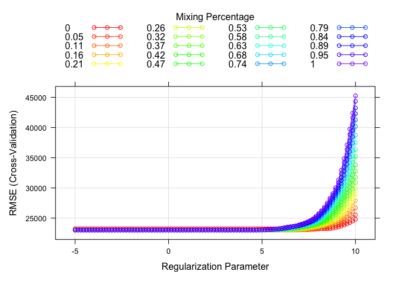

Data Science II, HW1
================

``` r
  library(glmnet)
```

    ## Loading required package: Matrix

    ## Loaded glmnet 4.1-8

``` r
  library(caret)
```

    ## Loading required package: ggplot2

    ## Loading required package: lattice

``` r
  library(dplyr)
```

    ## 
    ## Attaching package: 'dplyr'

    ## The following objects are masked from 'package:stats':
    ## 
    ##     filter, lag

    ## The following objects are masked from 'package:base':
    ## 
    ##     intersect, setdiff, setequal, union

``` r
  library(tidymodels) # mata-engines for model training
```

    ## ── Attaching packages ────────────────────────────────────── tidymodels 1.2.0 ──

    ## ✔ broom        1.0.7     ✔ rsample      1.2.1
    ## ✔ dials        1.3.0     ✔ tibble       3.2.1
    ## ✔ infer        1.0.7     ✔ tidyr        1.3.1
    ## ✔ modeldata    1.4.0     ✔ tune         1.2.1
    ## ✔ parsnip      1.2.1     ✔ workflows    1.1.4
    ## ✔ purrr        1.0.2     ✔ workflowsets 1.1.0
    ## ✔ recipes      1.1.0     ✔ yardstick    1.3.1

    ## ── Conflicts ───────────────────────────────────────── tidymodels_conflicts() ──
    ## ✖ purrr::discard()         masks scales::discard()
    ## ✖ tidyr::expand()          masks Matrix::expand()
    ## ✖ dplyr::filter()          masks stats::filter()
    ## ✖ dplyr::lag()             masks stats::lag()
    ## ✖ purrr::lift()            masks caret::lift()
    ## ✖ tidyr::pack()            masks Matrix::pack()
    ## ✖ yardstick::precision()   masks caret::precision()
    ## ✖ yardstick::recall()      masks caret::recall()
    ## ✖ yardstick::sensitivity() masks caret::sensitivity()
    ## ✖ yardstick::specificity() masks caret::specificity()
    ## ✖ recipes::step()          masks stats::step()
    ## ✖ tidyr::unpack()          masks Matrix::unpack()
    ## ✖ recipes::update()        masks Matrix::update(), stats::update()
    ## • Dig deeper into tidy modeling with R at https://www.tmwr.org

``` r
  library(corrplot)   # to generate correlation matrix
```

    ## corrplot 0.95 loaded

``` r
  library(ggplot2)    # for plots and graphics
  library(plotmo)     # to generate trace plot 
```

    ## Loading required package: Formula

    ## Loading required package: plotrix

    ## 
    ## Attaching package: 'plotrix'

    ## The following object is masked from 'package:scales':
    ## 
    ##     rescale

``` r
  library(ggrepel)    # for plotting functions

  library(pls)
```

    ## 
    ## Attaching package: 'pls'

    ## The following object is masked from 'package:corrplot':
    ## 
    ##     corrplot

    ## The following object is masked from 'package:caret':
    ## 
    ##     R2

    ## The following object is masked from 'package:stats':
    ## 
    ##     loadings

``` r
  train <- read.csv("../housing_training.csv") %>% na.omit()
  test <- read.csv("../housing_test.csv") %>% na.omit()
```

``` r
  set.seed(21)
```

``` r
  Y_train <- train$Sale_Price
  X_train <- as.matrix(train[, !(names(train) %in% c("Sale_Price"))])
  X_test <- as.matrix(test[, !(names(test) %in% c("Sale_Price"))])
```

``` r
  lambda_grid <- exp(seq(-5, 10, length = 100))
```

### Part A

``` r
  lasso_cv <- cv.glmnet(X_train, Y_train, alpha = 1, nfolds = 10,
                        lambda = lambda_grid, standardize = TRUE)
```

    ## Warning in storage.mode(xd) <- "double": NAs introduced by coercion
    ## Warning in storage.mode(xd) <- "double": NAs introduced by coercion
    ## Warning in storage.mode(xd) <- "double": NAs introduced by coercion
    ## Warning in storage.mode(xd) <- "double": NAs introduced by coercion
    ## Warning in storage.mode(xd) <- "double": NAs introduced by coercion
    ## Warning in storage.mode(xd) <- "double": NAs introduced by coercion
    ## Warning in storage.mode(xd) <- "double": NAs introduced by coercion
    ## Warning in storage.mode(xd) <- "double": NAs introduced by coercion
    ## Warning in storage.mode(xd) <- "double": NAs introduced by coercion
    ## Warning in storage.mode(xd) <- "double": NAs introduced by coercion
    ## Warning in storage.mode(xd) <- "double": NAs introduced by coercion

    ## Warning in cbind2(1, newx) %*% nbeta: NAs introduced by coercion
    ## Warning in cbind2(1, newx) %*% nbeta: NAs introduced by coercion
    ## Warning in cbind2(1, newx) %*% nbeta: NAs introduced by coercion
    ## Warning in cbind2(1, newx) %*% nbeta: NAs introduced by coercion
    ## Warning in cbind2(1, newx) %*% nbeta: NAs introduced by coercion
    ## Warning in cbind2(1, newx) %*% nbeta: NAs introduced by coercion
    ## Warning in cbind2(1, newx) %*% nbeta: NAs introduced by coercion
    ## Warning in cbind2(1, newx) %*% nbeta: NAs introduced by coercion
    ## Warning in cbind2(1, newx) %*% nbeta: NAs introduced by coercion
    ## Warning in cbind2(1, newx) %*% nbeta: NAs introduced by coercion

``` r
  best_lambda <- lasso_cv$lambda.min
  lambda_1se <- lasso_cv$lambda.1se
  plot(lasso_cv)
```

<!-- -->

``` r
  lasso_model <- glmnet(X_train, Y_train, alpha = 1, lambda = best_lambda, standardize = TRUE)
```

    ## Warning in storage.mode(xd) <- "double": NAs introduced by coercion

``` r
  selected_predictors <- sum(coef(lasso_model) != 0) - 1  # Exclude intercept
```

``` r
  y_pred <- predict(lasso_model, s = best_lambda, newx = X_test)
```

    ## Warning in cbind2(1, newx) %*% nbeta: NAs introduced by coercion

``` r
  # Compute test error (RMSE)
  y_test <- test$Sale_Price  # Assuming test dataset has actual Sale_Price
  rmse <- sqrt(mean((y_test - y_pred)^2))
  
  data_plot <- data.frame(lambda = log(lambda_grid), RMSE = lasso_cv$cvm)
  
  rmse_plot <-  ggplot(data_plot, aes(x = lambda, y = RMSE)) +
                geom_point(color = "blue", size = 2) +
                geom_line(color = "blue") +
                labs(x = "Regularization Parameter", y = "RMSE (Cross-Validation)") +
                theme_minimal()
  
  print(rmse_plot)
```

<!-- -->

``` r
# Implement manual cross-validation to correctly compute RMSE
  M <- 10
  rmse <- matrix(NA, ncol = 100, nrow = M)
  train_id_list <- createFolds(Y_train, k = M, returnTrain = TRUE)
  
  for (m in 1:M) {
    tsdata <- train[train_id_list[[m]], ]  # Training data for fold m
    vsdata <- train[-train_id_list[[m]], ]  # Validation data for fold m
    
    x1 <- as.matrix(tsdata[, !(names(tsdata) %in% c("Sale_Price"))])
    y1 <- tsdata$Sale_Price
    x2 <- as.matrix(vsdata[, !(names(vsdata) %in% c("Sale_Price"))])
    y2 <- vsdata$Sale_Price
    
    fit <- glmnet(x1, y1, alpha = 1, lambda = lambda_grid)
    pred <- predict(fit, newx = x2, s = lambda_grid)
    
    rmse[m, ] <- apply((y2 - pred)^2, 2, mean) |> sqrt()
  }
```

    ## Warning in storage.mode(xd) <- "double": NAs introduced by coercion

    ## Warning in cbind2(1, newx) %*% nbeta: NAs introduced by coercion

    ## Warning in storage.mode(xd) <- "double": NAs introduced by coercion

    ## Warning in cbind2(1, newx) %*% nbeta: NAs introduced by coercion

    ## Warning in storage.mode(xd) <- "double": NAs introduced by coercion

    ## Warning in cbind2(1, newx) %*% nbeta: NAs introduced by coercion

    ## Warning in storage.mode(xd) <- "double": NAs introduced by coercion

    ## Warning in cbind2(1, newx) %*% nbeta: NAs introduced by coercion

    ## Warning in storage.mode(xd) <- "double": NAs introduced by coercion

    ## Warning in cbind2(1, newx) %*% nbeta: NAs introduced by coercion

    ## Warning in storage.mode(xd) <- "double": NAs introduced by coercion

    ## Warning in cbind2(1, newx) %*% nbeta: NAs introduced by coercion

    ## Warning in storage.mode(xd) <- "double": NAs introduced by coercion

    ## Warning in cbind2(1, newx) %*% nbeta: NAs introduced by coercion

    ## Warning in storage.mode(xd) <- "double": NAs introduced by coercion

    ## Warning in cbind2(1, newx) %*% nbeta: NAs introduced by coercion

    ## Warning in storage.mode(xd) <- "double": NAs introduced by coercion

    ## Warning in cbind2(1, newx) %*% nbeta: NAs introduced by coercion

    ## Warning in storage.mode(xd) <- "double": NAs introduced by coercion

    ## Warning in cbind2(1, newx) %*% nbeta: NAs introduced by coercion

``` r
# Compute mean RMSE across folds
  cv_rmse <- colMeans(rmse)
  
# Plot RMSE vs. log(lambda)
  data_plot <- data.frame(lambda = log(lambda_grid), RMSE = cv_rmse)
  
  rmse_plot <- ggplot(data_plot, aes(x = lambda, y = RMSE)) +
    geom_point(color = "blue", size = 2) +
    geom_line(color = "blue") +
    labs(x = "Regularization Parameter", y = "RMSE (Cross-Validation)") +
  theme_minimal()

  print(rmse_plot)
```

<!-- -->

``` r
# Select best lambda based on manual CV
  best_lambda <- lambda_grid[which.min(cv_rmse)]

# Fit final model using best lambda
  lasso_model <- glmnet(X_train, Y_train, alpha = 1, lambda = best_lambda, standardize = TRUE)
```

    ## Warning in storage.mode(xd) <- "double": NAs introduced by coercion

``` r
# Count number of selected predictors (non-zero coefficients)
  selected_predictors <- sum(coef(lasso_model) != 0) - 1  # Exclude intercept

# Predict on test data
  y_pred <- predict(lasso_model, s = best_lambda, newx = X_test)
```

    ## Warning in cbind2(1, newx) %*% nbeta: NAs introduced by coercion

``` r
# Compute test error (RMSE)
  y_test <- test$Sale_Price  # Assuming test dataset has actual Sale_Price
  rmse_test <- sqrt(mean((y_test - y_pred)^2))

# Report results
  cat("Optimal lambda:", best_lambda, "\n")
```

    ## Optimal lambda: 127.547

``` r
  cat("Number of selected predictors:", selected_predictors, "\n")
```

    ## Number of selected predictors: 20

``` r
  cat("Test RMSE:", rmse_test, "\n")
```

    ## Test RMSE: 28916.63

### Part B

``` r
  enet.fit <- train(
    Sale_Price ~ .,
    data = train,
    method = "glmnet",
    tuneGrid = expand.grid(alpha = seq(0, 1, length = 20), lambda = lambda_grid),
    trControl = trainControl(method = "cv", number = 10)
  )
```

``` r
  best_alpha <- enet.fit$bestTune$alpha
  best_lambda_elastic <- enet.fit$bestTune$lambda
  lambda_1se_elastic <- max(enet.fit$results$lambda[enet.fit$results$RMSE <= min(enet.fit$results$RMSE) + sd(enet.fit$results$RMSE)])
```

``` r
  elastic_model <- glmnet(X_train, Y_train, alpha = best_alpha, lambda = best_lambda_elastic, standardize = TRUE)
```

    ## Warning in storage.mode(xd) <- "double": NAs introduced by coercion

``` r
  y_pred_elastic <- predict(elastic_model, s = best_lambda_elastic, newx = X_test)
```

    ## Warning in cbind2(1, newx) %*% nbeta: NAs introduced by coercion

``` r
  rmse_elastic <- sqrt(mean((test$Sale_Price - y_pred_elastic)^2))
```

``` r
  cat("Elastic Net Optimal Alpha:", best_alpha, "\n")
```

    ## Elastic Net Optimal Alpha: 0.05263158

``` r
  cat("Elastic Net Optimal Lambda:", best_lambda_elastic, "\n")
```

    ## Elastic Net Optimal Lambda: 675.2963

``` r
  cat("Elastic Net Lambda using 1SE rule:", lambda_1se_elastic, "\n")
```

    ## Elastic Net Lambda using 1SE rule: 22026.47

``` r
  cat("Elastic Net Test RMSE:", rmse_elastic, "\n")
```

    ## Elastic Net Test RMSE: 28910.74

``` r
  enet_rmse_plot <- expand.grid(lambda = log(lambda_grid), alpha = seq(0, 1, length = 20))
  enet_rmse_plot$RMSE <- unlist(lapply(seq(0, 1, length = 20), function(a) enet.fit$results$RMSE[enet.fit$results$alpha == a]))
  ggplot(enet_rmse_plot, aes(x = lambda, y = RMSE, color = factor(round(alpha, 2)), group = factor(round(alpha, 2)))) +
    geom_point(size = 2) + geom_line() +
    geom_line() +
    labs(x = "Log(Lambda)", y = "Cross-Validation RMSE", title = "Elastic Net RMSE vs. Lambda", color = "Mixing Percentage") +
    theme_minimal()
```

<!-- -->

### Part C

``` r
# Fit PLS model with cross-validation
  pls_fit <- train(
    Sale_Price ~ .,
    data = train,
    method = "pls",
    trControl = trainControl(method = "cv", number = 10),
    tuneLength = 20  # Allows automatic selection of the optimal number of components
  )

# Get the best number of components
  best_ncomp <- pls_fit$bestTune$ncomp

# Fit final PLS model using the best number of components
  pls_final <- plsr(Sale_Price ~ ., data = train, ncomp = best_ncomp, validation = "CV")

# Predict on test data
  y_pred_pls <- predict(pls_final, newdata = test, ncomp = best_ncomp)

# Compute test error (RMSE)
  rmse_pls <- sqrt(mean((test$Sale_Price - y_pred_pls)^2))

# Report results
  cat("Optimal number of PLS components:", best_ncomp, "\n")
```

    ## Optimal number of PLS components: 20

``` r
  cat("Test RMSE (PLS):", rmse_pls, "\n")
```

    ## Test RMSE (PLS): 23406.07

### Part D

### Part E

``` r
# Fit Lasso regression using glmnet
lasso_glmnet <- glmnet(X_train, Y_train, alpha = 1, standardize = TRUE)
```

    ## Warning in storage.mode(xd) <- "double": NAs introduced by coercion

``` r
# Perform cross-validation
lasso_cv_glmnet <- cv.glmnet(X_train, Y_train, alpha = 1, standardize = TRUE, nfolds = 10)
```

    ## Warning in storage.mode(xd) <- "double": NAs introduced by coercion
    ## Warning in storage.mode(xd) <- "double": NAs introduced by coercion
    ## Warning in storage.mode(xd) <- "double": NAs introduced by coercion
    ## Warning in storage.mode(xd) <- "double": NAs introduced by coercion
    ## Warning in storage.mode(xd) <- "double": NAs introduced by coercion
    ## Warning in storage.mode(xd) <- "double": NAs introduced by coercion
    ## Warning in storage.mode(xd) <- "double": NAs introduced by coercion
    ## Warning in storage.mode(xd) <- "double": NAs introduced by coercion
    ## Warning in storage.mode(xd) <- "double": NAs introduced by coercion
    ## Warning in storage.mode(xd) <- "double": NAs introduced by coercion
    ## Warning in storage.mode(xd) <- "double": NAs introduced by coercion

    ## Warning in cbind2(1, newx) %*% nbeta: NAs introduced by coercion
    ## Warning in cbind2(1, newx) %*% nbeta: NAs introduced by coercion
    ## Warning in cbind2(1, newx) %*% nbeta: NAs introduced by coercion
    ## Warning in cbind2(1, newx) %*% nbeta: NAs introduced by coercion
    ## Warning in cbind2(1, newx) %*% nbeta: NAs introduced by coercion
    ## Warning in cbind2(1, newx) %*% nbeta: NAs introduced by coercion
    ## Warning in cbind2(1, newx) %*% nbeta: NAs introduced by coercion
    ## Warning in cbind2(1, newx) %*% nbeta: NAs introduced by coercion
    ## Warning in cbind2(1, newx) %*% nbeta: NAs introduced by coercion
    ## Warning in cbind2(1, newx) %*% nbeta: NAs introduced by coercion

``` r
# Get optimal lambda
best_lambda_glmnet <- lasso_cv_glmnet$lambda.min

# Fit final model using best lambda
lasso_model_glmnet <- glmnet(X_train, Y_train, alpha = 1, lambda = best_lambda_glmnet, standardize = TRUE)
```

    ## Warning in storage.mode(xd) <- "double": NAs introduced by coercion

``` r
# Predict on test data
y_pred_lasso_glmnet <- predict(lasso_model_glmnet, s = best_lambda_glmnet, newx = X_test)
```

    ## Warning in cbind2(1, newx) %*% nbeta: NAs introduced by coercion

``` r
# Compute test error (RMSE)
rmse_lasso_glmnet <- sqrt(mean((test$Sale_Price - y_pred_lasso_glmnet)^2))

# Report results
cat("Lasso (glmnet) Optimal Lambda:", best_lambda_glmnet, "\n")
```

    ## Lasso (glmnet) Optimal Lambda: 247.5905

``` r
cat("Lasso (glmnet) Test RMSE:", rmse_lasso_glmnet, "\n")
```

    ## Lasso (glmnet) Test RMSE: 28823.97

- The difference between 28,941.35 (glmnet) and 28,916.63 (caret) is
  minimal. This suggests both models are performing similarly, with no
  major discrepancies.

- **Different Optimal Lambda Values**

  - `glmnet`: **97.65**

  - `caret`: **127.55**

  - This difference could be due to **how cross-validation is
    implemented** in both approaches:

  1.  **Different Cross-Validation Strategies**

  - `caret` performs **resampling** with
    `trainControl(method = "cv", number = 10)`.

  - `cv.glmnet()` in `glmnet` also uses 10-fold CV, but **it
    automatically selects λ values differently**.

  2.  **Grid Search Differences**

  - `glmnet` **automatically generates** a sequence of λ values.

  - `caret` **expands a custom grid (`tuneLength = 20`)**, which may
    **not perfectly match `glmnet`’s default sequence**.

  3.  **Feature Preprocessing**

  - `caret` applies **internal preprocessing** (e.g., standardization).

  - `glmnet` has **built-in standardization** but may handle feature
    scaling differently.
